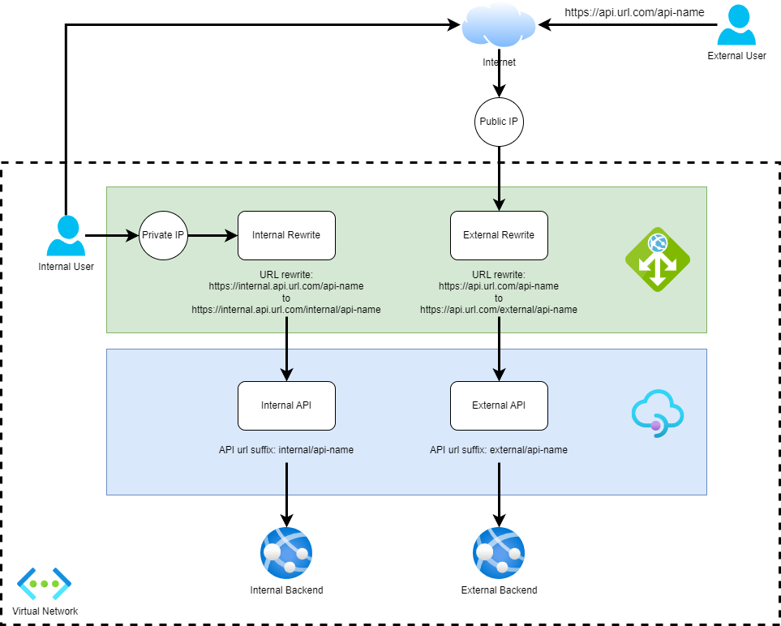

# Unlocking the Power of API Management: Exposing Internal and External APIs with Application Gateway

At Arinco we build a lot of APIs and when it comes to publishing them for consumption we do that through Azure API Management. Sometimes these APIs are only for internal use within a customer's network and other times they are for external use via the internet.

Needless to say one of the most important things, if not the most important thing when starting an API program is security. When it comes to security there are a few things we should do to secure our APIs in API Management. Some of the main ones are:

- Use [OAuth authentication](https://learn.microsoft.com/en-us/azure/api-management/validate-jwt-policy)
- Configure [rate limiting](https://learn.microsoft.com/en-us/azure/api-management/rate-limit-policy)
- Use [subscription/api keys](https://learn.microsoft.com/en-us/azure/api-management/api-management-subscriptions)
- Configure [logging and monitoring](https://learn.microsoft.com/en-us/azure/api-management/observability)

But what if we want to take it a step further and lock down some of our APIs by ensuring that connections to them never leave our internal network? Well we can do that using Azure Application Gateway.

Microsoft has released some architectural patterns and guidance on how to achieve this [Protect APIs with Application Gateway and API Management](https://learn.microsoft.com/en-us/azure/architecture/reference-architectures/apis/protect-apis) which proposes the following architecture.

This is a good solution and a powerful architecture, however it exposes the internal configuration (via `/external` and `/internal`) to end users, what if we want our users to have a more transparent experience?

In this blog post we are going to show you how you can configure API Management and Application Gateway to expose both external and internal APIs, ensuring that internal APIs cannot be accessed via the internet, while providing a transparent experience to users. At the same time as all of this we will enable internal development teams to target both the external and internal APIs.

## Goals

Before we set out on describing the architecture we will define the goals we are aiming to achieve with the pattern.

The pattern should enable the same functionality as the existing architecture with the following additional requirements:

- External users should not know there are internal APIs
- External users should not be able to target internal APIs
- Internal users should be able to target both internal and external APIs
- API Management should maintain a clear distinction between internal and external APIs

## Architecture

The above architecture proposes that Application Gateway is configured with both public and private IP addresses and respective listeners. These listeners have URL rewrites applied which insert `/internal` and `/external` in the base URL. APIs in Azure API Management are then configured with API URL suffixes of `/internal` and `/external`. The result is Application Gateway will route requests from its public and private IP addresses to the respective `/internal` and `/external` APIs in API Management. In addition with the DNS configuration of api.url.com and internal.api.url.com to the public and private IP addresses respectively, internal developers can target both the internal and external APIs as they wish.

### Configuration

- Public DNS configuration:
  - api.url.com bound to the public IP address of the Application Gateway
- Private DNS configuration:
  - internal.api.url.com bound to the private IP address of the Application Gateway
- Certificates:
  - api.url.com
  - internal.api.url.com
- Application Gateway sets up the following configuration:
  - Public and private listeners on port 443 bound to public and private IP addresses respectively. At the time of writing [listeners on the same port is in public preview](https://learn.microsoft.com/en-us/azure/application-gateway/configuration-listeners#frontend-port).
  - [Certificates configured](https://learn.microsoft.com/en-us/azure/application-gateway/end-to-end-ssl-portal) on their respective listeners.
  - [URL path rewrite](https://learn.microsoft.com/en-us/azure/application-gateway/rewrite-http-headers-url) configuration bound to the public listener to route requests to `/external{var_uri_path}`
  - [URL path rewrite](https://learn.microsoft.com/en-us/azure/application-gateway/rewrite-http-headers-url) configuration bound to the private listener to route requests to `/internal{var_uri_path}`
- API Management sets up the following configuration:
  - [Custom domain](https://learn.microsoft.com/en-us/azure/api-management/configure-custom-domain) for api.url.com with respective certificate
  - [Custom domain](https://learn.microsoft.com/en-us/azure/api-management/configure-custom-domain) for internal.api.url.com with respective certificate
  - External API configured with an API URL suffix of `external/{api_name}`
  - Internal API configured with an API URL suffix of `internal/{api_name}`

In this blog article we showed you how to configure API Management and Application Gateway to expose both external and internal APIs, while providing a transparent experience to users. In our next blog post in this series we will show you how you can deploy this using Azure Bicep.
